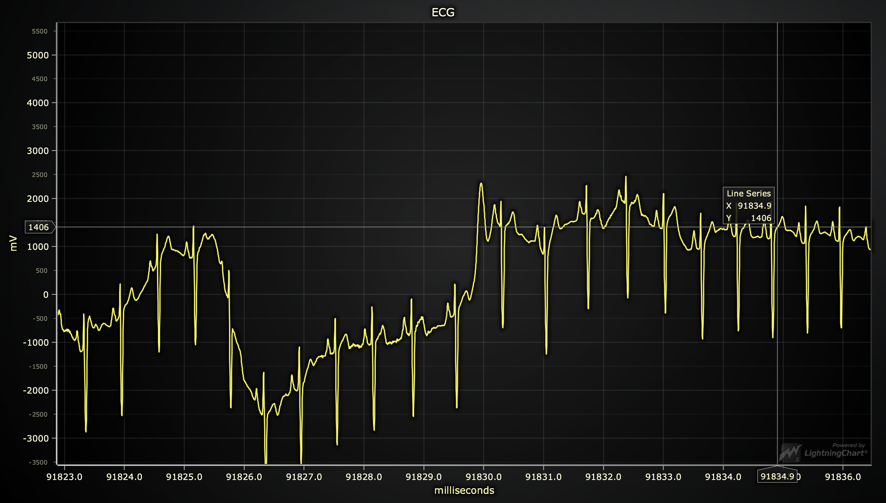

# ECG Data Visualization in React (NextJS) 📈💕

> Node v16.14.2

> Stable in Google Chrome Version 112.0.5615.49 (Official Build) (x86_64)

> Read the README in the node-converter folder too.

For our application, we were provided with a dataset in .7z format containing tens of millions of entries, which required preprocessing before it could be utilized in a simulated API call. The goal was to display this dataset in the form of an ECG Data Visualization chart using React (and LightingChart). Due to the large size of the dataset, we faced several challenges in handling it, such as socket hang issues during server-side rendering of the data. Additionally, we encountered problems with string length when converting the data to a string format, and we had to address issues related to file system (FS) limitations when handling data over 2GB in size.

If we were working on a real-life project with a larger budget, we could explore different solutions, such as server-side rendering (SSR) of data fetching using proxy services to simulate calls from multiple IP addresses. We could also consider storing the data in a SQL database that offers indexing and sorting capabilities, using S3 buckets, and employing parallelization to leverage cloud services for computation.

Our strategy for this project involves pre-processing the data using Node.js scripts to generate static data that will be sent to the frontend through a Next.js internal API endpoint. We intentionally decided to load the data at the beginning to optimize the performance of the chart once it becomes available, instead of gradually feeding data to the chart. The user can easily navigate through the chart data using the default navigation commands provided by LightingChart. To move back and forth in the chart data, users can utilize a combination of commands, including zooming.

## Pre-processing Data in Node.js: Serving Millions of Entries Statically through a Next.js Internal API Endpoint

Pre-processing a huge amount of data in Node.js to serve it statically through a Next.js internal API endpoint is beneficial when we have tenth of millions of entries for several reasons:

- Performance: When dealing with a massive amount of data, pre-processing it and serving it statically can improve performance significantly. This is because pre-processing allows us to format the data in a way that is optimized for serving it quickly, and serving it statically removes the need to query a database or run computationally expensive code on the server every time a request is made.

- Scalability: Pre-processing data and serving it statically can also make our application more scalable. By removing the need for database queries or computationally expensive code on the server, we can reduce the load on our server and make it easier to scale our application to handle more traffic.

- Caching: Since the data is pre-processed and served statically, it can be easily cached at various levels, such as in the browser, on the CDN, or on the server. This can further improve performance and reduce the load on our server.

- Flexibility: By pre-processing the data, we have more flexibility in how we serve and consume it. We can easily serve it through an internal API endpoint in Next.js, which allows us to use the same codebase for both client and server-side rendering. We can also consume the data in other applications or services if needed.

Pre-processing a huge amount of data in Node.js and serving it statically through a Next.js internal API endpoint can improve performance, scalability, caching, and flexibility, making our application more efficient and easier to maintain.

## Data Fetching on the Client Side (CSR) in Next.js

The benefit of using CSR when we have this amount of data and this architecture is that it allows for a faster initial page load. With SSR, the server has to fetch all the data and render the HTML before sending it to the client, which can take a long time for large datasets. With CSR, the page can be rendered quickly without the data, and the data can be fetched and displayed using JavaScript after the page has loaded.

The code we use fetches data from multiple files containing large amounts of data using the fetchDataForFiles function, and then concatenates all the data into a single array. The function uses pagination to reduce the amount of data returned in each request, with the default of 2000 items per page. It also takes a signal to allow aborting the request if necessary.

The Layout component manages the fetching of data and the loading state of the application. It uses the useState hook to manage the messages and isLoading states, and the useEffect hook to trigger data fetching when the component mounts.

The data is fetched in two batches, one for the first half of the files and another for the second half. Each batch is fetched in parallel using the Promise.all method to speed up the process.

Once all data is fetched, it is passed as a prop to the Chart component which visualizes it in a chart. The Chart component is loaded asynchronously using the dynamic function from the next/dynamic package, with the ssr option set to false to prevent server-side rendering.

This approach allows for efficient fetching of large amounts of data while keeping the application responsive by fetching the data in smaller chunks and using pagination. It also loads the chart component asynchronously to avoid slowing down the initial rendering of the page.

### Dev

`npm run dev`

### Build

`npm run build`

### Start

`npm run start`

### Lint

`npm run lint`

### Test

`npm run test`

### You can find another README in the `node-converter ` folder for the Node.js scripts
